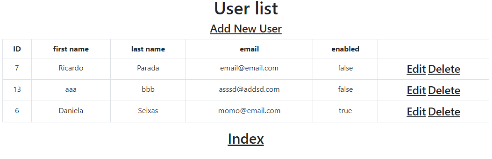
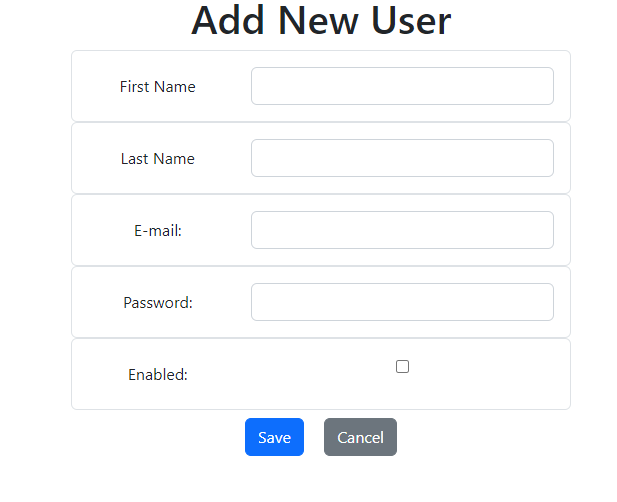
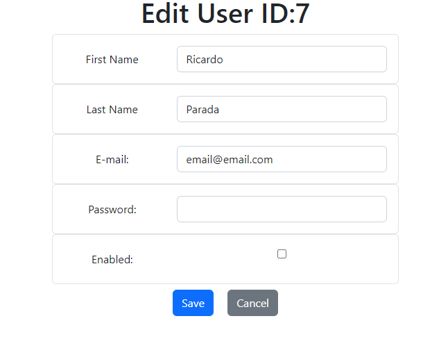
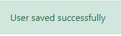
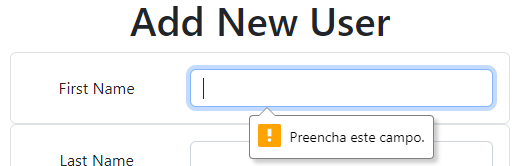
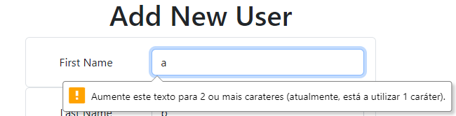
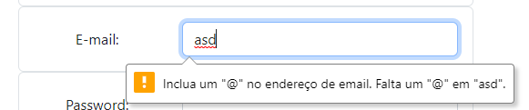
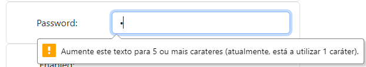

# Spring Boot CRUD application

## About
The following repo contains a Spring Boot CRUD example, without the use of postman/insomnia, but as a web application.

## I've learned how to:
* use packages for cleaner code
* use Model class and addAttribute method
* string interpolation to use and manipulate variables
* redirect to views
* extend Throwable in order to create a personalized exception message
* use Service to catch exceptions using if statements for all usefull use cases as the app is developed
* create templates for views
* use thymeleaf, although the syntax isn't recognised in Intellij Community (free version)
* use thymeleaf string interpolation to display messages or insert data from classes, form action for an object with foreach to list all fields, routing
* validate fields properties and rules, e.g. password must be at least 5 characters long

## Run this application:
* create a postgres database named springbootcrud
* update your postgres credentials at resources/application.properties:
```
spring.datasource.username=username
spring.datasource.password=password
```
* run the application and open browser at:
```
http://localhost:8080/
```
### Routing:
* "/" index page:


* "/users" CRUD table



* "/users/new" new user form:



* "/users/edit/USER_ID_HERE" edit user form



### Warning messages:











 